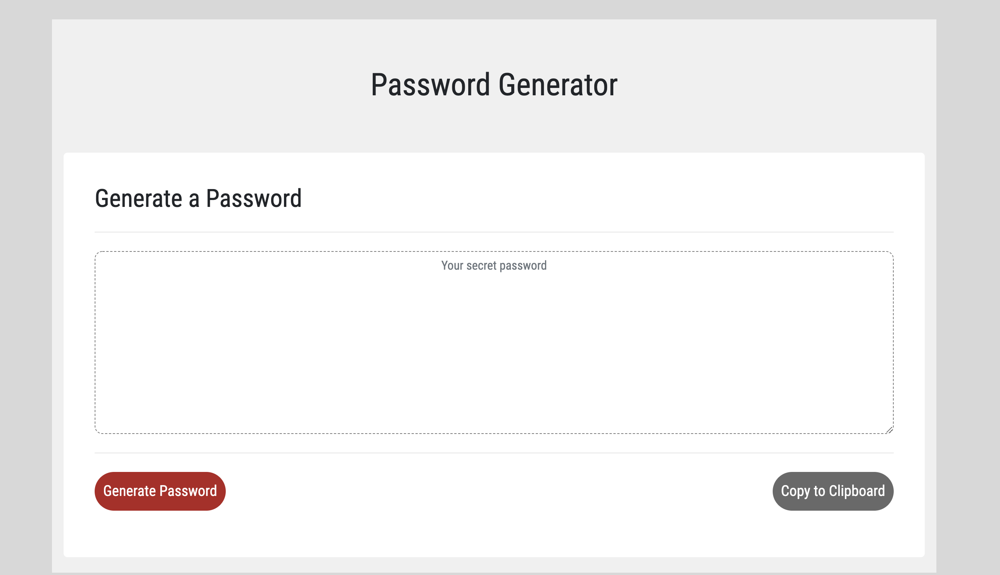

# PasswordGenerator
Generate a password with your own selection criteria

HTML, CSS and JavaScript are used to generate a password that fulfills your self-selected selection criteria

This application generates a random password based on user-selected criteria. This app will run in the browser and feature dynamically updated HTML and CSS powered by your JavaScript code.
The user will be prompted to choose from the following password criteria:

Length (must be between 8 and 128 characters) and character type:

Special characters, numeric characters, lowercase characters, uppercase characters.

The application sends in alert, if the user did not select any character type.
When all prompts are answered, a password matching the answered prompts will be displayed. The use has the option to copy their password to their clipboard.

Link to the deplayed GitHub Pages URL: https://steffield.github.io/PasswordGenerator/

Screenshot of the application:

